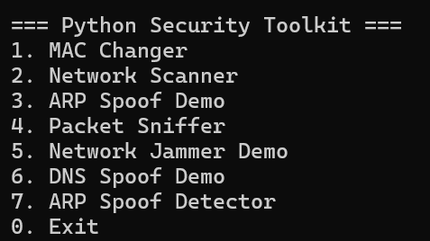
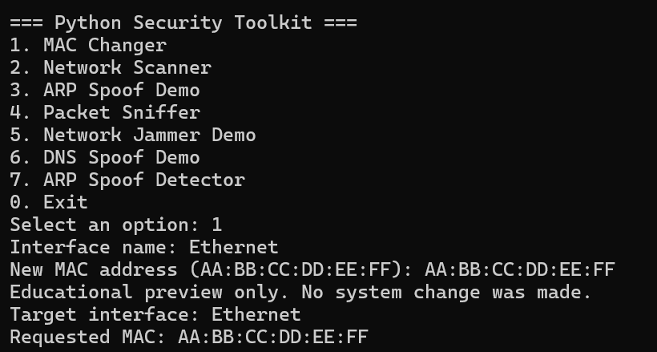
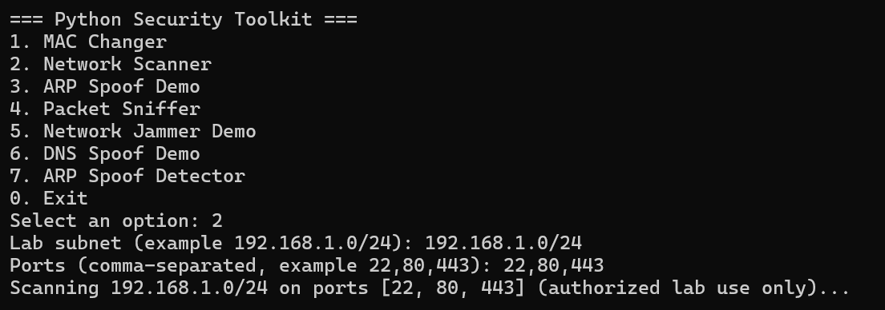
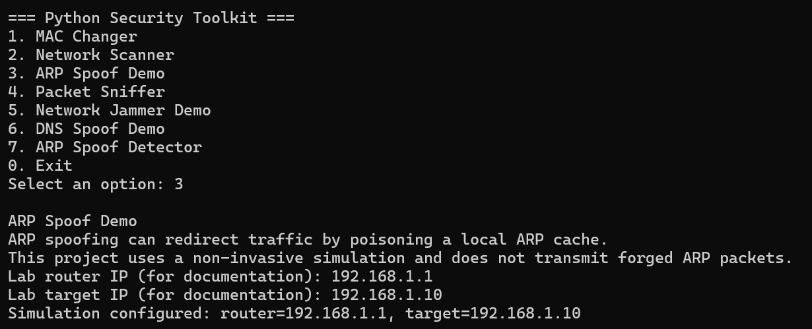
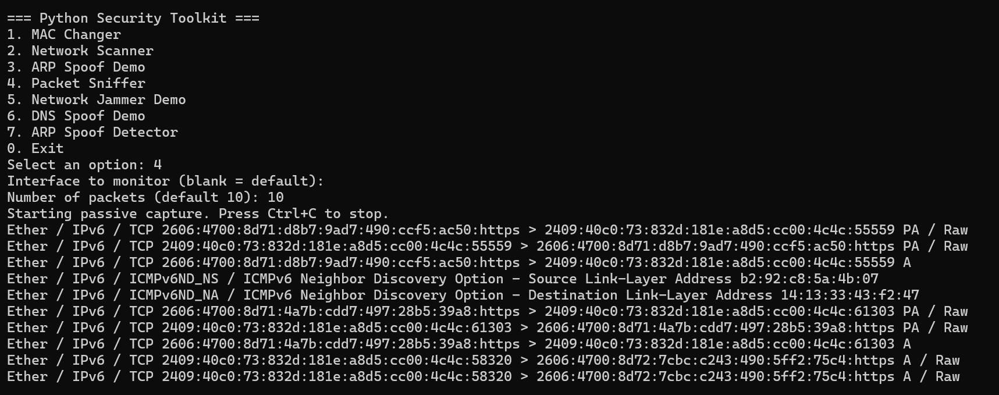
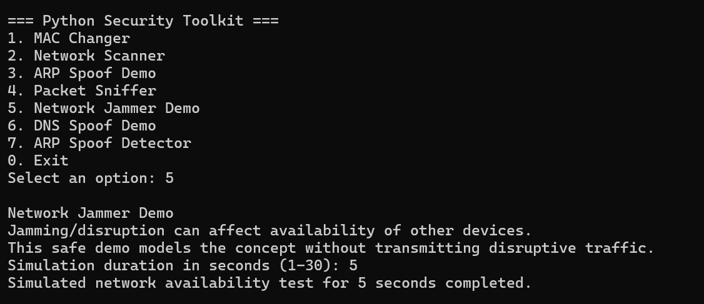
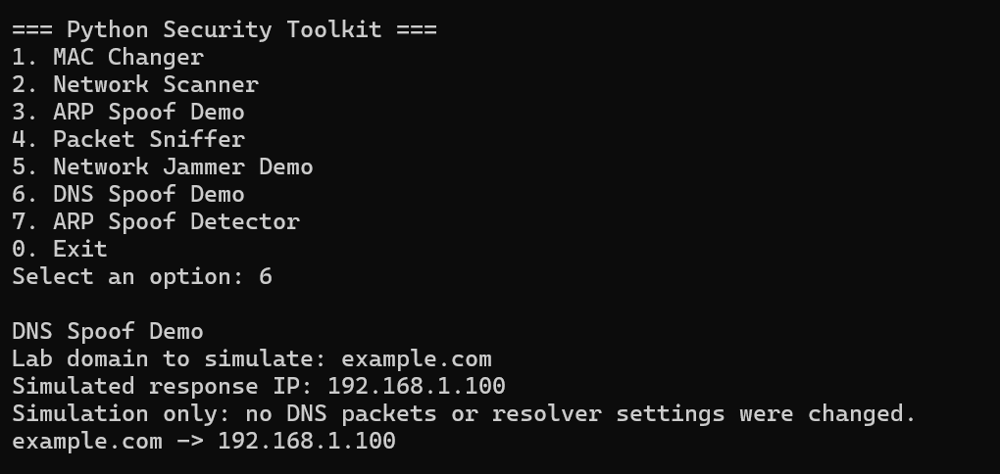
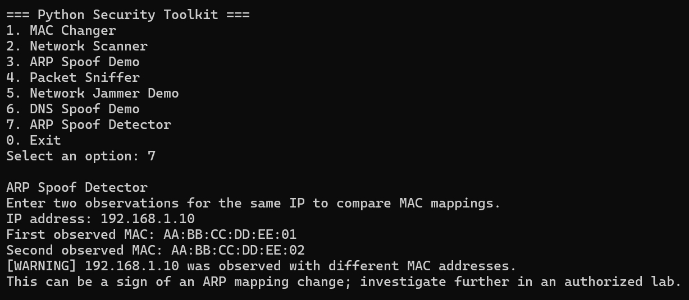

# 🛡️ Python Security Toolkit

> A modular Python cybersecurity toolkit that demonstrates essential network-security and ethical-hacking concepts through a single command-line application, with a strong focus on safe, authorized, and educational use.

<div align="center">


</div>

---

## 📌 Overview

**Python Security Toolkit** is a second-year Computer Engineering project developed to bring multiple cybersecurity concepts together in one organized Python CLI application.

The toolkit covers seven modules related to network security, traffic analysis, spoofing concepts, availability attacks, and detection. Modules that could otherwise alter or disrupt network traffic are deliberately implemented as **safe simulations**, making the project suitable for coursework, demonstrations, and authorized lab environments.

### 🔐 Security-first approach

- Network scanning is intended for authorized lab subnets only.
- Packet capture is passive and should be performed only on permitted interfaces and traffic.
- ARP spoofing, DNS spoofing, and network-jamming components are demonstrations/simulations rather than disruptive implementations.
- The MAC changer validates and previews a requested change without automatically modifying the host.

---

## ✨ Features

- 🖥️ Single command-line launcher with a menu-driven interface
- 🔧 Modular Python architecture
- 🌐 Authorized TCP network scanning
- 📡 Passive packet inspection using Scapy
- 🔄 ARP spoofing concept demonstration
- 🚫 Safe network-jamming concept demonstration
- 🌍 DNS spoofing concept demonstration
- 🕵️ ARP spoof detection through IP/MAC mapping comparison
- ✅ Input validation and clear CLI feedback
- 📸 Project screenshots and testing documentation

---

## 🧩 Modules

| # | Module | Description | Implementation |
|---|---|---|---|
| 01 | **MAC Changer** | Validates and previews a requested MAC address | Educational preview; no automatic system change |
| 02 | **Network Scanner** | Checks selected TCP ports on a supplied subnet | Authorized lab scanning |
| 03 | **ARP Spoof Demo** | Demonstrates the concept of ARP poisoning | Simulation only |
| 04 | **Packet Sniffer** | Displays packet summaries using Scapy | Passive capture only |
| 05 | **Network Jammer Demo** | Demonstrates the concept of network availability disruption | Simulation only |
| 06 | **DNS Spoof Demo** | Demonstrates how manipulated DNS mappings work | Simulation only |
| 07 | **ARP Spoof Detector** | Compares observed IP/MAC mappings for changes | Detection only |

---

## 🏗️ Architecture

```text
                         ┌──────────────────────┐
                         │       main.py        │
                         │   CLI / Menu System  │
                         └──────────┬───────────┘
                                    │
             ┌──────────────────────┼──────────────────────┐
             │                      │                      │
             ▼                      ▼                      ▼
      ┌─────────────┐        ┌─────────────┐        ┌─────────────┐
      │ MAC Changer │        │   Network   │        │ ARP Spoof   │
      │             │        │   Scanner   │        │    Demo     │
      └─────────────┘        └─────────────┘        └─────────────┘
             │                      │                      │
             └──────────────────────┼──────────────────────┘
                                    │
             ┌──────────────────────┼──────────────────────┐
             │                      │                      │
             ▼                      ▼                      ▼
      ┌─────────────┐        ┌─────────────┐        ┌─────────────┐
      │   Packet    │        │   Network   │        │    DNS      │
      │   Sniffer   │        │   Jammer    │        │   Spoof     │
      └─────────────┘        └─────────────┘        └─────────────┘
                                    │
                                    ▼
                           ┌─────────────────┐
                           │ ARP Spoof       │
                           │ Detector        │
                           └─────────────────┘
```

---

## 📂 Project Structure

```text
python-security-toolkit/
│
├── main.py
├── requirements.txt
├── README.md
├── .gitignore
│
├── modules/
│   ├── __init__.py
│   ├── mac_changer.py
│   ├── network_scanner.py
│   ├── arp_spoofer.py
│   ├── packet_sniffer.py
│   ├── network_jammer.py
│   ├── dns_spoofer.py
│   └── arp_spoof_detector.py
│
├── screenshots/
│   ├── 01-main-menu.png
│   ├── 02-mac-changer.png
│   ├── 03-network-scanner.png
│   ├── 04-arp-demo.png
│   ├── 05-packet-sniffer.png
│   ├── 06-jammer-demo.png
│   ├── 07-dns-demo.png
│   └── 08-arp-detector.png
│
├── docs/
│   └── TESTING.md
│
└── report/
    └── project_report.md
```

---

## 🛠️ Tech Stack

| Technology | Usage |
|---|---|
| **Python 3.10+** | Core programming language |
| **Scapy** | Passive packet inspection |
| **Socket / Networking APIs** | TCP connectivity checks |
| **CLI / Terminal** | User interaction and module launcher |
| **Git & GitHub** | Version control and project hosting |

---

## ⚙️ Installation

### 1. Clone the repository

```bash
git clone https://github.com/Mrunal-dev05/python-security-toolkit.git
cd python-security-toolkit
```

### 2. Create a virtual environment

**Windows:**

```powershell
python -m venv .venv
.venv\Scripts\activate
```

**Linux / macOS:**

```bash
python3 -m venv .venv
source .venv/bin/activate
```

### 3. Install dependencies

```bash
pip install -r requirements.txt
```

### 4. Run the toolkit

```bash
python main.py
```

> Some packet-capture operations may require elevated privileges depending on the operating system and network configuration.

---

## ▶️ Usage

After starting the application, the main menu provides access to the seven modules.

```text
╔══════════════════════════════════════╗
║       PYTHON SECURITY TOOLKIT        ║
╠══════════════════════════════════════╣
║  1. MAC Changer                      ║
║  2. Network Scanner                  ║
║  3. ARP Spoof Demo                   ║
║  4. Packet Sniffer                   ║
║  5. Network Jammer Demo              ║
║  6. DNS Spoof Demo                   ║
║  7. ARP Spoof Detector               ║
║  0. Exit                             ║
╚══════════════════════════════════════╝
```

Choose a module and follow its prompts using only values belonging to an authorized test environment.

---

## 📸 Screenshots

### Main Menu



### MAC Changer



### Network Scanner



### ARP Spoof Demo



### Packet Sniffer



### Network Jammer Demo



### DNS Spoof Demo



### ARP Spoof Detector



---

## 🧪 Testing

The project includes module-level testing documentation in [`docs/TESTING.md`](docs/TESTING.md).

Testing focuses on:

- CLI menu and invalid-input handling
- MAC-address validation
- Network scanner execution on an authorized subnet
- Safe ARP spoofing simulation
- Passive packet capture
- Safe network-jamming simulation
- Safe DNS spoofing simulation
- ARP IP/MAC mismatch detection

Screenshots in this repository provide visual evidence of the project demonstrations.

---

## 📊 Project Documentation

A detailed academic report is included in the repository:

📄 [`report/project_report.md`](report/project_report.md)

The report covers the project abstract, objectives, technologies, architecture, module documentation, testing methodology, results, limitations, future improvements, and conclusion.

---

## 🔒 Ethical & Safety Notice

This project is intended for **cybersecurity education, coursework, experimentation, and authorized testing only**.

Do not scan, capture, spoof, modify, or disrupt systems or networks without permission. The ARP spoofing, DNS spoofing, and network-jamming components are intentionally designed as non-invasive demonstrations, and the MAC changer does not automatically alter the host configuration.

---

## 🚀 Future Improvements

- Add structured JSON output for scan and detection results
- Improve cross-platform network-interface discovery
- Add richer packet-analysis summaries
- Add automated unit and integration test coverage
- Add configurable lab profiles
- Add a lightweight graphical/web dashboard
- Add exportable project results and logs

---

## 👨‍💻 Author

<div align="center">

### Mrunal Prashant Pimpale

**BE - Computer Engineering | Second Year**  
**New Horizon Institute of Technology and Management**

[](https://github.com/Mrunal-dev05)

</div>

---

## 📄 License

This project is created for academic learning, cybersecurity education, and authorized lab demonstrations.
